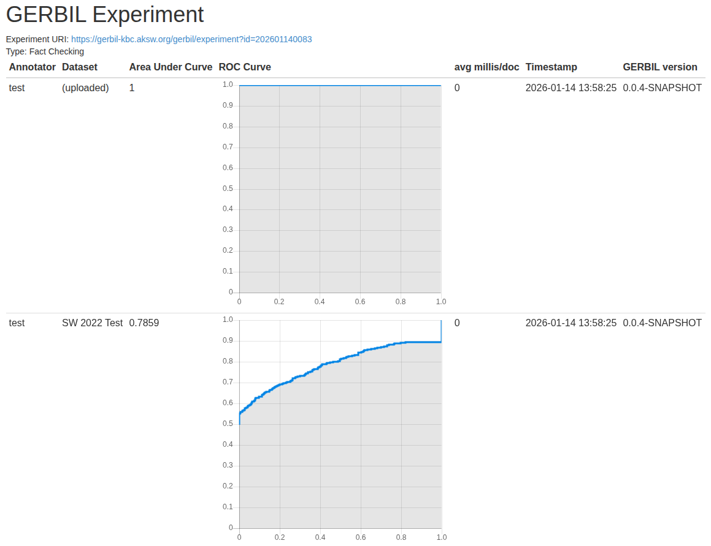

# KG-Based Fact Checking Engine

**Course:** Fundamentals of Knowledge Graphs        
**By:** Avishkar Arjan      
**Group:** 13   
**GERBIL AUC score:** .7859 (78.59%)

## Problem Statement        

Predict the veracity of an RDF triple using evidence from a Knowledge Graph.

## Solution Approach

* Use DBpedia as a reference Knowledge Graph
* Learn TransE embeddings to represent entities and relations
* Engineer KG-based features and train supervised models
* Use an ensemble for final prediction stability

| Stage | Notebook                          | Purpose                 | Key Operations                                                                                                                    |
| ----- | --------------------------------- | ----------------------- | --------------------------------------------------------------------------------------------------------------------------------- |
| **1** | `1_filter_dbpedia.ipynb`    | Create reference KG     | Download DBpedia (2022-12-01), extract entities from train/test, filter triples by subject/object, save reference dataset         |
| **2** | `2_training_transe_embeddings.ipynb` | Learn KG embeddings     | Load filtered DBpedia KG, split data, train TransE using PyKEEN, save embeddings                                                  |
| **3** | `3_fact_check.ipynb`           | Predict triple veracity | Load KG + embeddings, compute tensor features, train Logistic Regression, Random Forest, and Ensemble models, output `result.ttl` |

## Usage/ Reproduce results
- You can run each notebook, stagewise, as mentioned in the above table
- OR just run `3_fact_check.ipynb` to reproduce the `result.ttl` file using the pre-trained embeddings.

## Libraries Used

* `torch`
* `numpy`
* `rdflib`
* `pykeen`
* `scikit-learn`
* `pandas`
* `networkx`

## Requirements

* Python 3.x
* Jupyter Notebook or Google Colab
* DBpedia dataset access
* GPU recommended for embedding training

## Training Environment

* Models trained on **Google Colab**
* GPU: **NVIDIA T4**
